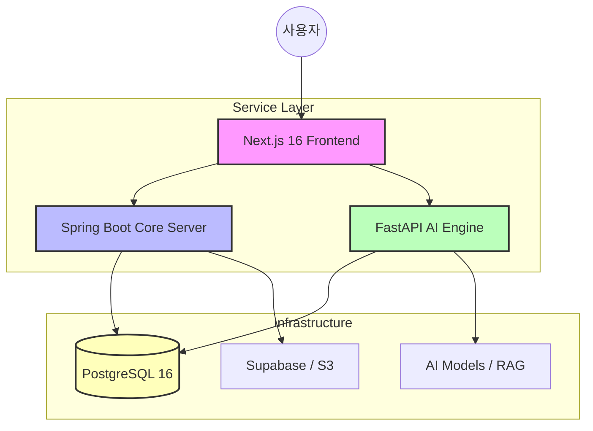
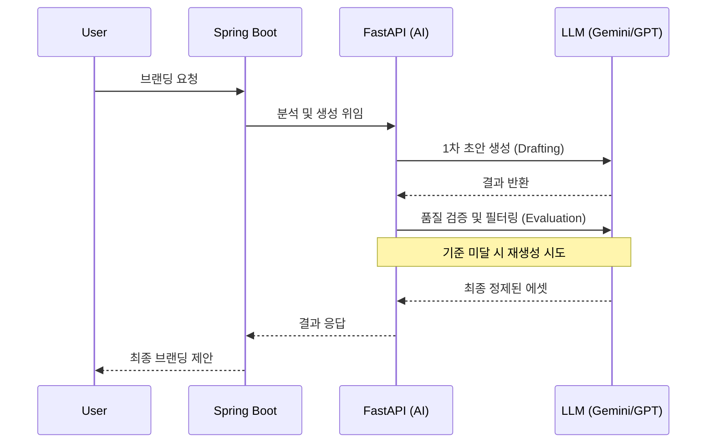

<div align="center">
  
  <h1>🌌 Nexus (넥서스)</h1>
  <p><b>AI 기반 통합 미디어 브랜딩 및 데이터 기반 창업 지원 플랫폼</b></p>

  [](https://nextjs.org/)
  [](https://spring.io/projects/spring-boot)
  [](https://fastapi.tiangolo.com/)
  [](https://www.postgresql.org/)
  [](https://www.docker.com/)
</div>

---

## 🚀 1. 프로젝트 개요 (Overview)
**Nexus**는 소상공인과 예비 창업자를 위한 **All-in-One 지능형 창업 지원 플랫폼**입니다. 단순한 정보 제공을 넘어, AI 기술을 활용하여 브랜드 아이덴티티를 구축하고 데이터에 기반한 실질적인 사업 의사결정을 돕습니다.

- **브랜드 정체성 확립**: AI가 네이밍부터 로고, 슬로건까지 맞춤형 브랜딩 에셋을 생성합니다.
- **리스크 최소화**: 상권 데이터와 비용 시뮬레이션을 통해 창업 초기 시행착오를 줄입니다.
- **데이터 기반 운영**: 매출 예측 및 고객 감성 분석을 통해 지속 가능한 성장을 지원합니다.

---

## ✨ 2. 핵심 기능 (Key Features)

### 🎨 AI 브랜딩 엔진 (AI Branding)
- **Multi-Stage Workflow**: 단순 생성을 넘어, LLM 기반의 'Self-Correction Loop'를 통해 네이밍과 슬로건의 품질을 자동 검증하고 개선합니다.
- **이미지 생성**: DALL-E 3 등 최신 이미지 모델을 연동하여 업종별 최적화된 로고를 즉시 제작합니다.

### 🏢 창업 시뮬레이션 (Startup Simulation)
- **상권 분석**: PostgreSQL의 공간 쿼리와 공공 데이터를 결합하여 해당 지역의 업종 밀집도와 유동인구를 분석합니다.
- **비용 예측**: 지능형 알고리즘을 통해 인테리어, 임대료, 초기 인건비 등 상세 창업 비용을 예측합니다.

### 📊 지능형 대시보드 (Intelligent Dashboard)
- **매출 예측**: FastAPI 기반의 시계열 분석 모델을 통해 미래 매출 추이를 시각화합니다.
- **감성 분석**: 고객 리뷰를 AI가 분석하여 긍정/부정 키워드를 추출하고 운영 개선점을 제안합니다.

---

## 🏗️ 3. 시스템 아키텍처 (System Architecture)

Nexus는 확장성과 유지보수성을 극대화하기 위해 **도메인 중심(Domain-Driven) 아키텍처**와 **마이크로 서비스 지향적 구조**를 채택했습니다.



---

## 🤖 4. AI 파이프라인 (AI Pipeline)

Nexus의 핵심 경쟁력은 AI의 **자기 교정 루프(Self-Correction Loop)**에 있습니다.



---

## 📂 5. 프로젝트 구조 (Directory Structure)

```text
nexus/
├── frontend-next/     # Next.js 16 (App Router, TypeScript)
├── backend-spring/    # Spring Boot 3.3 (Core Business Logic, JPA)
├── backend-fastapi/   # FastAPI (AI Logic, Data Analysis)
├── db/                # DB Initialization Scripts (Docker)
└── docker-compose.yml # 통합 컨테이너 오케스트레이션
```

---

## 🛠️ 6. 기술 스택 (Technical Stack)

| 구분 | 기술 (Technology) | 상세 내역 |
| :--- | :--- | :--- |
| **Frontend** | `Next.js 16`, `React 19`, `Tailwind CSS` | 고성능 UI/UX 및 서버 사이드 렌더링 |
| **Backend (Core)** | `Spring Boot 3.3`, `Java 17`, `JPA` | 안정적인 비즈니스 로직 및 API 관리 |
| **Backend (AI)** | `FastAPI`, `Python 3.10`, `LangChain` | 고성능 AI 엔진 및 데이터 처리 파이프라인 |
| **Database** | `PostgreSQL 16`, `Supabase Storage` | 관계형 데이터 및 대용량 파일 관리 |
| **DevOps** | `Docker`, `Docker Compose`, `GitHub Actions` | 일관된 개발 및 배포 환경 보장 |

---

## ⚙️ 7. 시작하기 (Quick Start)

### 🐘 1단계: 인프라 기동 (Docker)
```bash
# PostgreSQL DB 실행
docker-compose up -d
```

### 🏃 2단계: 서버 실행
각 폴더의 README를 참고하거나 아래 명령어를 실행하세요.
- **FastAPI**: `cd backend-fastapi && python -m app.main`
- **Spring Boot**: `cd backend-spring && ./gradlew bootRun`
- **Next.js**: `cd frontend-next && npm run dev`

---

## 💎 8. 코드 품질 및 협업 (Quality & Collaboration)

- **코드 컨벤션**: `.agent-conventions.md`를 통해 AI와 인간 개발자 간의 일관된 코드 품질을 유지합니다.
- **린트/포맷**: `Checkstyle`(Java), `Ruff`(Python), `ESLint/Prettier`(TS)를 통해 엄격히 관리됩니다.

---
<div align="center">
  <p>© 2026 Nexus Team. All rights reserved.</p>
</div>
